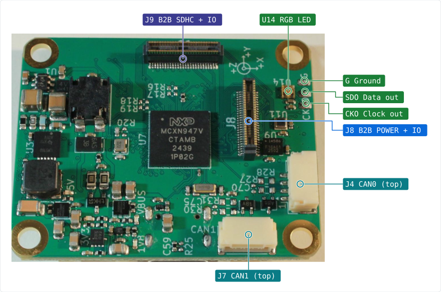
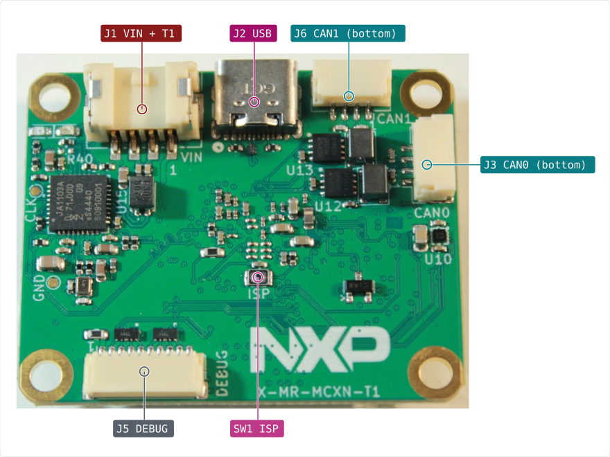
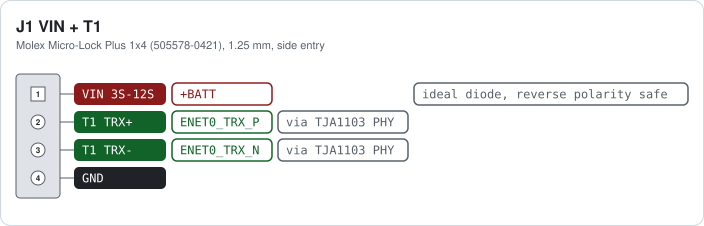
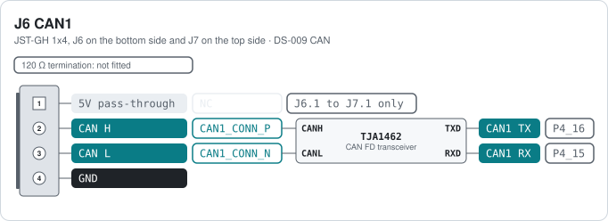
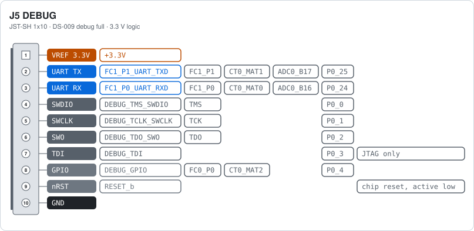
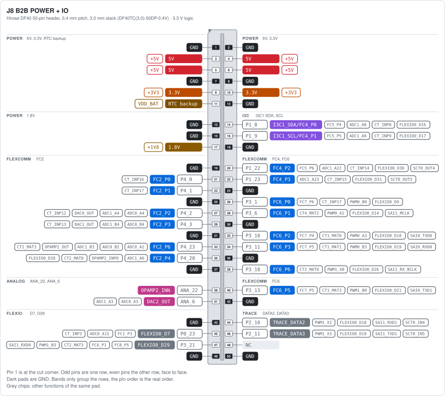
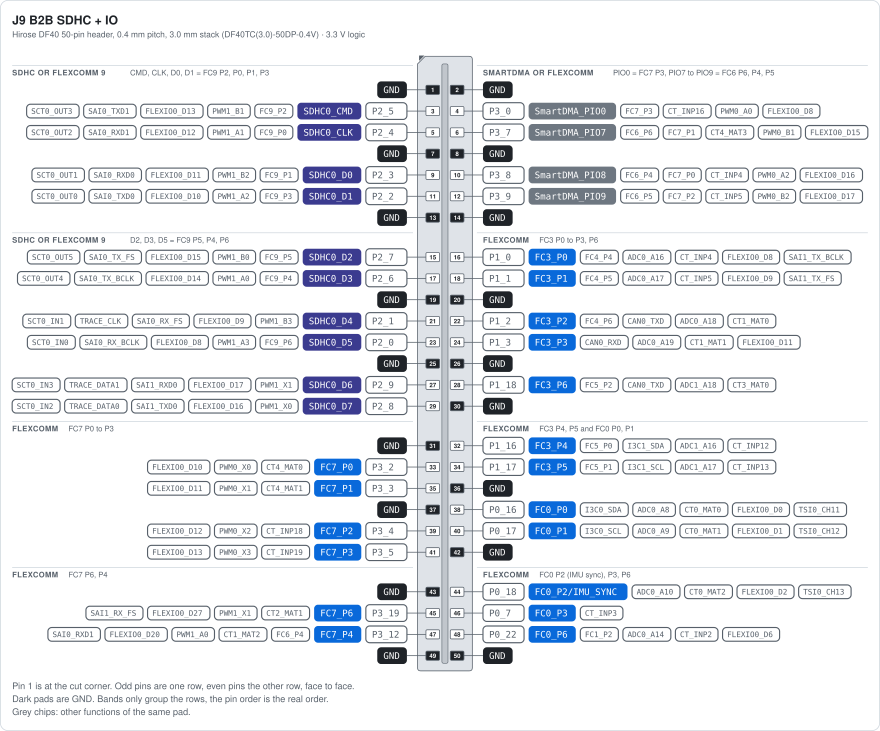
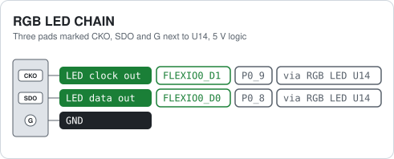
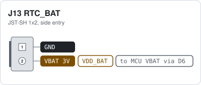

# MR-MCXN-T1 Hub

> [!NOTE]
> An MCXN947 based multi-purpose base board with a modular board-to-board connector interface. 
> The base board is supplied with the following features:
> - 3S-12S supply voltage
> - 100BASE-T1 Ethernet
> - 2x CAN
> - IMU (TDK InvenSense ICM-45686)
> - Magnetometer (Bosch BMM350)
> - Barometer (Bosch BMP581)
> - USB
> - 10-pin debug connector (Pixhawk standard)
> - Addressable RGB LED

> [!TIP]
> Possible use-cases for add-on boards:
> Camera, Microphone, Audio, SDIO, Mikrobus, Display, ADC, IO
>
> Please see the associated add-on boards [here](https://github.com/CogniPilot/spinali_mcxn_t1_shields).

MR-MCXN-T1 Top view  |  MR-MCXN-T1 Bottom view
:-------------------------:|:-------------------------:
 | 

> [!NOTE]
> Designed with KiCAD
> 
> All JST-GH connector pinouts follows the [DS-009 Connector Standard](https://github.com/pixhawk/Pixhawk-Standards/blob/master/DS-009%20Pixhawk%20Connector%20Standard.pdf).

> [!NOTE]
> If desiring to contribute please open [all PRs here](https://github.com/CogniPilot/spinali_mcxn_t1_hub/pulls).

## Board overview

All pin data below comes from the KiCad design files in this repository.

Each card shows, per pin, the **function**, the **net name in the schematic** and the **MCU pad**
the signal ends up on. Parts in between, such as the CAN transceivers and the Ethernet PHY, are
shown too. Pin 1 is the square pad.

<!-- overview:top -->
<picture>
  <source media="(prefers-color-scheme: dark)" srcset="images/overview-top-dark.svg">
  
</picture>
<!-- /overview -->

<!-- overview-list:top -->
Not visible here: [J1 VIN + T1](#hub-j1-vin--t1) (bottom view) · [J2 USB](#hub-other-connectors) (bottom view) · [J5 DEBUG](#hub-j5-debug) (bottom view) · [J13 RTC_BAT](#hub-j13-rtc_bat) (bottom view) · [SW1 ISP](#buttons-and-switches) (bottom view)
<!-- /overview-list -->

Bottom side, with the power and Ethernet connector, USB, debug port and the bottom CAN connectors:

<!-- overview:bottom -->
<picture>
  <source media="(prefers-color-scheme: dark)" srcset="images/overview-bottom-dark.svg">
  
</picture>
<!-- /overview -->

## Connector index

<!-- index -->
| Ref | Function | Connector | Details |
|---|---|---|---|
| [Hub J1](#hub-j1-vin--t1) VIN + T1 | Battery input 3S to 12S and 100BASE-T1 Ethernet on one cable | Molex Micro-Lock Plus 1x4 (505578-0421), 1.25 mm, side entry |  |
| [Hub J2](#hub-other-connectors) USB | USB 2.0 high-speed device port | USB Type-C receptacle (USB4105-GF-A) | On USB1 of the MCXN947 (high speed). The board is always a USB device (CC pull-downs). VBUS powers the board through load switch U2 when no battery is connected. With SW1 held at power up the boot ROM listens here for ISP programming. |
| [Hub J3](#hub-j3-can0) CAN0 | CAN FD bus 0 (TJA1462), two connectors in parallel | JST-GH 1x4, J3 on the bottom side and J4 on the top side |  |
| [Hub J5](#hub-j5-debug) DEBUG | SWD, JTAG and console, DS-009 debug full layout | JST-SH 1x10 |  |
| [Hub J6](#hub-j6-can1) CAN1 | CAN FD bus 1 (TJA1462), two connectors in parallel | JST-GH 1x4, J6 on the bottom side and J7 on the top side |  |
| [Hub J8](#hub-j8-b2b-power--io) B2B POWER + IO | Add-on board connector 1: power rails and FlexComm, I3C, analog and trace pins | Hirose DF40 50-pin header, 0.4 mm pitch, 3.0 mm stack (DF40TC(3.0)-50DP-0.4V) |  |
| [Hub J9](#hub-j9-b2b-sdhc--io) B2B SDHC + IO | Add-on board connector 2: SDHC or FlexComm 9, SmartDMA or FlexComm 6/7, and more FlexComm pins | Hirose DF40 50-pin header, 0.4 mm pitch, 3.0 mm stack (DF40TC(3.0)-50DP-0.4V) |  |
| [Hub J13](#hub-j13-rtc_bat) RTC_BAT | Backup battery for the RTC | JST-SH 1x2, side entry |  |
| [Hub RGB](#hub-rgb-led-chain) LED CHAIN | Output of the on-board RGB LED, solder pads | Three pads marked CKO, SDO and G next to U14, 5 V logic |  |
<!-- /index -->

## Power, Ethernet and USB

<!-- heading:main/J1 -->
### Hub J1 VIN + T1
<!-- /heading -->

<!-- pinout:main/J1 -->
<picture>
  <source media="(prefers-color-scheme: dark)" srcset="images/main-J1-dark.svg">
  
</picture>

Pin 1 takes the battery, 3S to 12S (about 9 to 50 V), 10 W budget. An ideal diode (LM74700) blocks reverse polarity, a buck converter makes 5 V from it, and 3.3 V and 1.8 V come from the 5 V rail. The 5 V rail switches on above about 8 V. Pins 2 and 3 are the 100BASE-T1 pair, one twisted pair to the TJA1103 PHY. The PHY is the link slave (R41 fitted); remove R41 to make it the master. The other end of the T1 link must be the master. Mating parts from the schematic: socket 505570-0401, crimp 505572-1100, pre-crimped wires 217500-1125 (black) and 217500-2125 (red).

> [!CAUTION]
> Pin 1 is the only power input besides USB. Keep the battery above 3S, the board does not start below about 8 V.
<!-- /pinout -->

## CAN

<!-- heading:main/J3 -->
### Hub J3 CAN0
<!-- /heading -->

<!-- pinout:main/J3 -->
<picture>
  <source media="(prefers-color-scheme: dark)" srcset="images/main-J3-dark.svg">
  
</picture>

J3 (bottom) and J4 (top) carry the same bus, so one cable can come in and another go out. The transceiver runs from 5 V and talks to the chip at 3.3 V. Drive P4_14 (CAN0_STB) low to enable it. The split termination (R27, R28 and C70) is not fitted, so the bus must be terminated elsewhere, or fit the parts if the hub is one end of the bus.

> [!NOTE]
> Pin 1 is not powered. It is only linked between J3 and J4, so a 5 V supply on one cable passes to the other.
<!-- /pinout -->

<!-- heading:main/J6 -->
### Hub J6 CAN1
<!-- /heading -->

<!-- pinout:main/J6 -->
<picture>
  <source media="(prefers-color-scheme: dark)" srcset="images/main-J6-dark.svg">
  
</picture>

Same circuit as CAN0. J6 (bottom) and J7 (top) carry the same bus. Drive P4_17 (CAN1_STB) low to enable the transceiver. The split termination (R30, R31 and C75) is not fitted.

> [!NOTE]
> Pin 1 is not powered. It is only linked between J6 and J7, so a 5 V supply on one cable passes to the other.
<!-- /pinout -->

## Debug

<!-- heading:main/J5 -->
### Hub J5 DEBUG
<!-- /heading -->

<!-- pinout:main/J5 -->
<picture>
  <source media="(prefers-color-scheme: dark)" srcset="images/main-J5-dark.svg">
  
</picture>

Pin 1 is a 3.3 V reference output for the probe. Pins 2 and 3 are FlexComm 1 as a UART console. Pins 4 to 7 are the SWD and JTAG lines of the MCXN947, pin 8 is a spare GPIO for the probe, pin 9 is the chip reset, pulled up on the board.

> [!WARNING]
> Pin 1 is a reference output, not a supply input. Never power the board from it.
<!-- /pinout -->

## Board-to-board interface

<!-- heading:main/J8 -->
### Hub J8 B2B POWER + IO
<!-- /heading -->

<!-- pinout:main/J8 -->
<picture>
  <source media="(prefers-color-scheme: dark)" srcset="images/main-J8-dark.svg">
  
</picture>

Together with J9 this is the interface for the add-on boards (camera, audio, SDIO, mikroBUS, display, ADC, IO). Odd pins are one row, even pins the other, pin 1 at the cut corner. Limits from the schematic: 300 mA per pin, 5 V rail 1 A, 3.3 V rail 500 mA, 1.8 V rail 200 mA. Pin 11 is the RTC backup supply, shared with J13. The FlexComm blocks (FC2, FC4, FC6) can each be a UART, SPI or I2C. The grey chips list the other functions of each pad.

> [!TIP]
> The add-on board designs are in the spinali_mcxn_t1_shields repository, linked from the main README.
<!-- /pinout -->

<!-- heading:main/J9 -->
### Hub J9 B2B SDHC + IO
<!-- /heading -->

<!-- pinout:main/J9 -->
<picture>
  <source media="(prefers-color-scheme: dark)" srcset="images/main-J9-dark.svg">
  
</picture>

Second add-on connector. No power pins here, all supplies are on J8. Every signal pin has more than one job, that is the point of this interface. The SDHC0 pins carry an 8-bit SD or eMMC interface, but the same pads are FlexComm 9 (P0 to P6), so an add-on board can use them as one more UART, SPI or I2C instead. The SmartDMA pins are a parallel camera port and double as FlexComm 6 and 7 lines or PWM0 outputs. FC0, FC3 and FC7 can each be a UART, SPI or I2C. Pin 44 is also the IMU sync input. The grey chips list the other functions of each pad.
<!-- /pinout -->

## LED chain and RTC battery

<!-- heading:main/RGB -->
### Hub RGB LED CHAIN
<!-- /heading -->

<!-- pinout:main/RGB -->
<picture>
  <source media="(prefers-color-scheme: dark)" srcset="images/main-RGB-dark.svg">
  
</picture>

The MCU drives one SK9822 RGB LED (U14, APA102 compatible) from FlexIO pins P0_8 (data) and P0_9 (clock). CKO and SDO are the clock and data outputs of that LED, so more LEDs of the same type can be chained from here. The LED runs from 5 V, so its outputs are 5 V.
<!-- /pinout -->

<!-- heading:main/J13 -->
### Hub J13 RTC_BAT
<!-- /heading -->

<!-- pinout:main/J13 -->
<picture>
  <source media="(prefers-color-scheme: dark)" srcset="images/main-J13-dark.svg">
  
</picture>

Keeps the real-time clock of the MCXN947 running without main power. Fits the RPi RTC battery (ML2020 with a 2-pin JST-SH plug). The same supply is on J8 pin 11 for the add-on board. The board charges the cell from 3.3 V through D15 and a 75 Ω resistor.

> [!WARNING]
> The board trickle-charges this cell. Use a rechargeable ML2020 type, never a CR2032 or other non-rechargeable cell.
<!-- /pinout -->

<!-- others:main -->
### Hub other connectors

| Ref | Function | Connector | Notes |
|---|---|---|---|
| J2 USB | USB 2.0 high-speed device port | USB Type-C receptacle (USB4105-GF-A) | On USB1 of the MCXN947 (high speed). The board is always a USB device (CC pull-downs). VBUS powers the board through load switch U2 when no battery is connected. With SW1 held at power up the boot ROM listens here for ISP programming. |
<!-- /others -->

## Buttons and switches

<!-- switches -->
| Ref | Board | Function | Type | Notes |
|---|---|---|---|---|
| SW1 ISP | Hub | ISP boot button | Tactile switch, bottom side | Hold it while power comes up to start the boot ROM in ISP mode (P0_6 ISPMODE_N pulled low), for programming over USB or the debug UART. Normal boot otherwise. |
<!-- /switches -->

## On-board devices

How the sensors, the PHY and the LED are wired to the MCXN947. Useful for a device tree or
board file.

| Device | Bus | MCU pins | Notes |
|---|---|---|---|
| ICM-45686 IMU (U9) | SPI on FlexComm 8 | SCK P3_15, MOSI P3_14, MISO P3_16, CS P3_17, INT1 P3_22, FSYNC/INT2 P0_18 | P0_18 is also on J9 pin 44 as IMU sync. |
| BMM350 magnetometer (U10) | I3C0 (or I2C) | SDA P0_20, SCL P0_21, INT P0_19 | Address 0x14. Runs from 1.8 V. |
| BMP581 barometer (U11) | I3C0 (or I2C) | SDA P0_20, SCL P0_21, INT P0_11 | Address 0x47 (SDO pulled up, R48 not fitted). |
| TJA1103 100BASE-T1 PHY (U15) | RMII on ENET0 | TXD0 P1_6, TXD1 P1_7, TXEN P1_5, TXER P1_10, RXD0 P1_14, RXD1 P1_15, RXDV P1_13, RXER P1_12, REFCLK P1_4, MDC P1_20, MDIO P1_21, INT P1_19, RESET P1_11, WAKE P0_31 | Reverse RMII: the PHY supplies the 50 MHz reference clock. PHY address 18. Link slave, because R41 is fitted; remove R41 for master. The two LEDs next to J1 are driven by the PHY GPIO0 and GPIO1. |
| TJA1462 CAN FD transceivers (U12, U13) | FlexCAN0, FlexCAN1 | CAN0 TX P4_13, RX P4_12, STB P4_14; CAN1 TX P4_16, RX P4_15, STB P4_17 | Drive STB low to enable a transceiver. |
| SK9822 RGB LED (U14) | FlexIO | data P0_8, clock P0_9 | APA102 compatible, 5 V. Chain output on the CKO, SDO and G pads. |
| ISP button (SW1) | GPIO | P0_6 | ISPMODE_N, boot ROM ISP mode when held at power up. |

Test pads on the bottom side: CLK is the PHY reference clock (P1_4), GND is ground.

## Notes

- The JST-GH and JST-SH connectors follow the Dronecode
  [DS-009 connector standard](https://github.com/pixhawk/Pixhawk-Standards/blob/master/DS-009%20Pixhawk%20Connector%20Standard.pdf)
  (CAN and debug full), so standard cables fit. The CAN pin 1 is not powered on this board, and
  the CAN termination resistors are not fitted.
- The board runs from the battery on J1 or from USB. 5 V, 3.3 V and 1.8 V for an add-on board
  come from J8.
- The photos show a prototype marked X-MR-MCXN-T1. Its RTC battery connector J13 is not fitted.

> [!WARNING]
> Never feed power into the 5 V, 3.3 V or 1.8 V pins of J8, or into pin 1 of the debug port. Power the board through J1 or USB only.

## Downloads

This reference as an [A4 PDF](MR-MCXN-T1-Hub-hardware-reference.pdf), and all cards on one
A4 landscape sheet: [cheat sheet PDF](MR-MCXN-T1-Hub-cheatsheet.pdf).

NXP and the NXP logo are registered trademarks of NXP B.V. This document is maintained by the
community and is not an official NXP publication.
